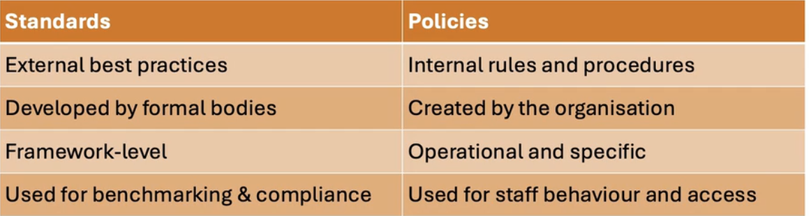

# Cybersecurity frameworks, standarts and policies
## Governance, Risk and Compliance (GRC)
- Governance:
    - How organization is directed and controlled. It includes leadership, rules, accountability and policy.
    - Aligns security with business goals
    - Establishes roles and accountability
    - Drives policy and ethical behavior
    - Ensures decision-making is transparent
- Risk management:
    - Is about identifying  potential threats and taking steps to reduce them
    - Assess impact and likelyhood
    - Mitigate or accept risks
    - Monitor risk continuosly
- Compliance:
    - Is the process of meeting legal, regulatory and mandatory contractual agreements such as GDPR or ISO 
    - Following industry frameworks like:
        - ISO 27001
        - NIST
        - GDPR
    - Demonstrate due diligence
    - Avoiding penalties and breaches
    - Builts trust with customers and partners

- Together, GRC helps to ensure that security decisions align with business goals and legal responsibilities

## Example: Healthcare provider
- Governance:
    - Appoints a chief information security officer (CISO)
- Risk management:
    - Asseses data privacy risks for patient records
- Compliance:
    - Follows GDPR and NHS cybersecurity standards

## Cybersecurity standards and policies
- Standards:
    - Agreed frameworks or guidelines
    - Developed by national or international bodies (ISO, NIST etc)
    - Help organisations structure security controls
    - Support legal and regulatory compliance
    - Examples:
        - ISO/IEC 27001: a global standard for an infosec management system (ISMS)
        - NIST CSF: US framework for improving critical infrastructure security
        - PCI DSS: a payment card industry data security standard
        - GDPR: EU regulation for personal data protection
- Policies:
    - Internal rules and procedures that:
        - Define acceptable use of system
        - Ensure password management, email and internet usage
    - Ensure that access control and data classification:
        - Aligned with standards and laws
        - Enforced across the organization
    - Examples:
        - Access control Policy
        - Data Classification Policy
        - Incident Response Policy
        - BYOD Policy
        - Password Policy
- 