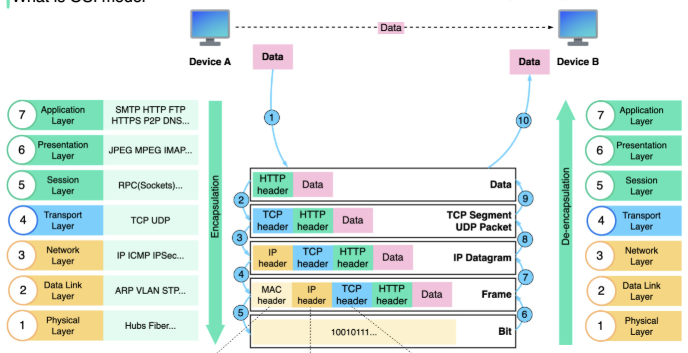
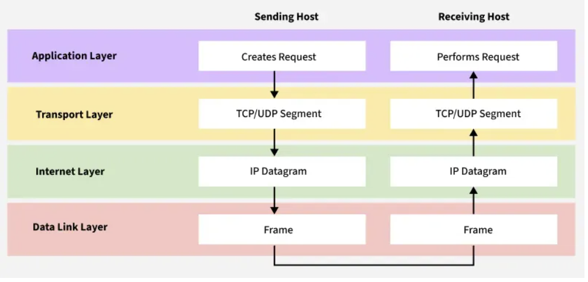
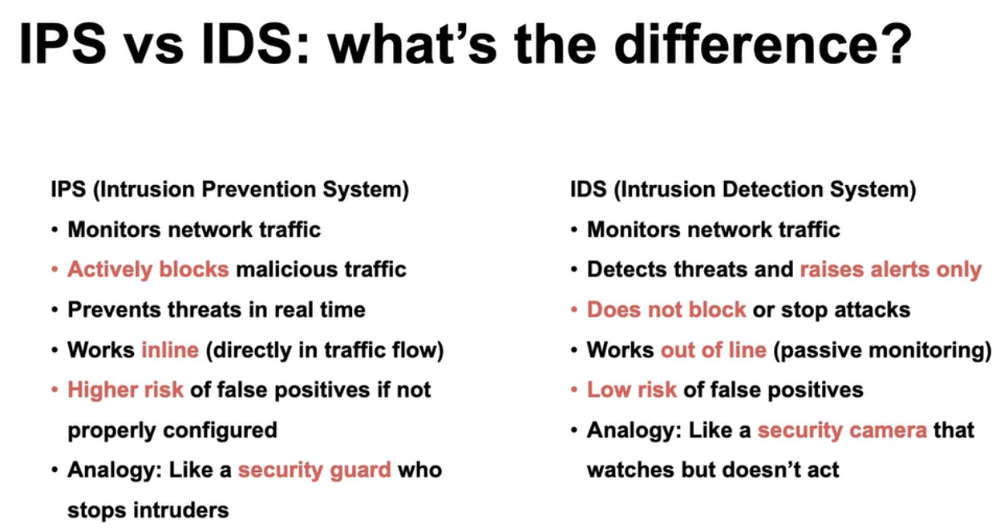
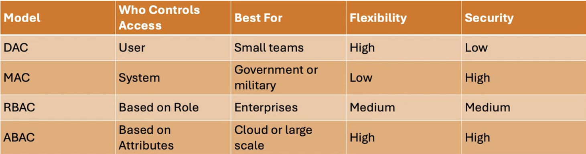

# ***Networks and OS security, part 1***
---
# Networks, operating systems and layered communication
- The OS:
    - Runs programs
    - Manages memory
    - Manages hardware/software
    - Handles files, I/O
    - Controls communication with other systems
- Network allows:
    - Devices to share data
    - Communication via IP addresses
    - Data transfer using protocols (eg TCP/IP)
    - Internet and local communication

## Layered system architecture:
- Systems are layered
- Each layer has a specific job
- Each layer communicates only with the layer directly above and below it, but higher layers rely on the services provided by lower layers
### Common models:
- OS Layers
    1. Application layer:
        - eg Chrome, Outlook
    2. Kernel:
        - CPU
        - Memory
        - Security
    3. Driver
        - Communicates with devices (keyboard, network card etc.)
    4. Network interface
        - Prepares and sends data

- Open System Interconnection (OSI) model:
    1. Physical layer:
        - Transmits raw bit stream over the physical medium
    2. Data link layer:
        - Defines the format of data on the network
    3. Network layer:
        - Decides which physical path the data will take
    4. Transport layer:
        - Transmits data using transmission protocols including TCP(Transmission Control Protocol) and UDP(User Datagram Protocol)
    5. Session layer:
        - Maintains connections and is responsible for controlling ports and sessions
    6. Presentation layer:
        - Ensures that data is in a usable format and is where data encryption occurs
    7. Application layer:
        - Human-Computer interaction layer, where applications can access the network services
    - 

- Transmission Control Protocol/Internet Protocol (TCP/IP)
    1. Application layer:
        - This is where all the apps connect to the network.
        - Acts like a bridge between software (Chrome, Gmail, WhatsApp etc) and the lower layers of the network that actually send and receive data
        - Manages data formatting, encryption and session management
    2. Transport layer:
        - Responsible for making sure data is sent reliably and in correct order, checks if data arrives safely and completely
        - Uses TCP or UDP, depending on whether the communication needs to be reliable or fast
        - TCP is used when data must be correct and complete, like loading web page or downloading a file
        - UDP is used when speed matters more than perfect accuracy, like live video or online games
    3. Internet layer:
        - Used for finding the best path for data to travel accross different networks so it can reach the right destination. Works like a traffic controller.
        - Uses IP to give every device unique IP address, which helps identify where data should go
        - The main job is routing, deciding the best way for data to travel
        - Takes care of packet forwarding, fragmentation and addressing
    4.Network access layer:
        - Deals with the actual physical connection between devices on the same local network like computers connected by cables or communicating through Wi-Fi
        - Makes sure data can travel over the hardware, such as wires, switches or wireless signals
        - Handles tasks like Media Access Control(MAC) addresses to identify devices, creating frames (the format used to send data over the physical link), and checking for basic errors during transmission.
    - 
- How OS and network layers work together:
    - Browser creates and passes request to OS
    - OS kernel: Checks for permissions, applies security policies, prepares data for transmission
    - Transport layer: TCP breaks data into smaller segments, adds port numbers
    - Internet layer: IP protocol adds destination IP address so network knows where data needs to go
    - Network Interface layer: converts data into signals and sends it out over the network
    - On the receiving side, the same process happens in reverse

- Why network models matter in CyberSecurity
    - Helps identify where attacks occur (eg app, network, transport)
    - Supports firewall, Intrusion Detection Systems/Intrusion Prevension Systems (IDS/IPS) and encryption decisions.
    - Explains how malware can move between layers
    - Helps troubleshoot and trace malicious traffic

## Firewalls
### 1. Stateless Firewall
- Does not require server to retain information about session
- Simple implementation
- Commonly refered to as Access Control List(ACL)
- Stateless, because it checks all traffic that's flowing through and applies a set of rules
- Checks every single incomming packet

### 2. Stateful firewall
- Overhead of server having to save information about a session
- Does not handle crashes well
- Complicated server design, architecture, implementation and scaling
- More efficient than ACL
- Once packet session is allowed, does not need to filter anymore

### 3. Proxy firewall
- Intermediary between clients and servers, passing client requests and managing answers
- Controls access by forwarding requests and may filter content based on policies.

# Intrusion Detection Systems(IDS)
---
- Detects abnormal usage pattern
- Essentially a pattern recognition
- Use what ever state-of-the-art pattern recognition system is at the time (ML, AI etc)
## Challenges
- Effectiveness:
    - False positives and negatives
- Performance:
    - Resource use and speed
- Ability to operate over whole network

## Commercial systems
- 1. Cisco Firepower
    - Hardware
    - Doesn't use ML
    - Purpose built appliances to provide the right throughput, modular design, and carrier-class scalability
- 2. The Darktrace Enterprise Immune System:
    - Software
    - Uses unsupervised machine learning and AI to understand about Your organization. Observing your users and devices, cloud containers and workflows, learns 'on the job' what is normal for your organization.

# Intrusion Prevention Systems(IPS)
- Monitors netword traffic in real time
- Compares packages to known signatures or behavioral patterns
- Takes action based on rules
- Logs everything and alerts admins
- Automatically blocks, drops or resets connections
- Can be placed:
    - Inline, between firewall and internal network
    - At key entry points (eg data centre, VPN, cloud gateway)
    - Integrated into Next-Generation Firewalls (NGFW)
- Stops threats before they spread
- Reduces load to internal systems
- Blocks known malware and exploits
- Helps meet compliance (GDPR, PCI DSS etc)
- 

## Detection techinques
- Signature based:
    - Matches known malware patterns with observed behaviors
- Anomaly based:
    - Flags unusual behavior, like sudden traffic spikes
- Policy based:
    - Uses administrator defined rules
- Hybrid:
    - Combines multiple of these techniques for better accuracy

## Limitations of IPS
- False positives may block legitimate users
- Requires ongoing updates and fine-tuning
- Can be a bottleneck if not properly sized

# Access Control Models
- Access control is rules for who can access what
- Prevents unauthorised access
- Protects systems, files and data
- Enforces organisational security policies

### Dicretionary Access Control(DAC)
- Access is controled by the resource owner
- Flexible but less secure, as users can grant access to others by changing permissions
- Common in personal computers and file sharing platforms

### Mandatory Access control(MAC)
- Access is based on system-wide security labels
- Users cannot change permissions
- Common in military and government systems
- Very secure but inflexible

### Role-Based Access Control(RBAC)
- Access is based on users role in the organisation
- Roles group permissions (eg Manager, HR, IT, Intern)
- Easier to manage at scale
- Common in businesses and enterprise systems

### Attribute-Based Access Control
- Most flexible model
- Access based on attributes (user, resource, environment)
- Supports complex rules (eg location, time)
- Powerful, but more complex to set up
- Used on cloud platforms and large scale systems

### Comparison of access control models
- 

## Why access control matters in Cyber Security
- Protects sensitive data 
- Minimises insider threats
- Supports compliance
- Reduces risk of accidental or malicious access
- Ensures that the right people have the right access at the right time.