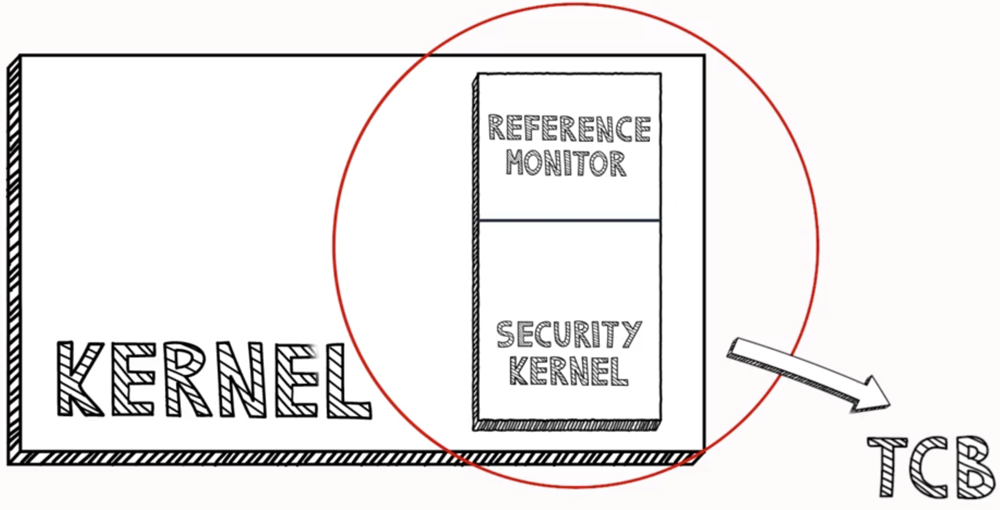

# Network and OS part 2
## Windows and OS hardening
- OS Security includes all precautionary control techniques that help protect computer resources that might be taken away, rewritten or removed if OS security is breached.
### Key components of secure OS
- Kernel:
    - Kernel is a component of OS that executes the services at the lowest level
        - Trusted Computing Base (TCB) contains:
            - Security kernel is responsible for managing all the OS security processes
            - Reference monitor is component of security kernel that manages access to the device.
            - 
- In Windows OS, basic security blocks are:
    - Security reference monitor(SRA):
        - Element of kernel mode that executes access checks, sets audit log entries and manipulates privileges, eventually, SRM performs every permission check.
    - Local security authorithy:
        - Executes Windows local security policies publishes users authentification tokens as they sign into the network. Also includes authentication policy and privileged parameters.
    - Security account manager(SAM):
        - Database that stores user credentials and related individual user and local community sensitive data. When user signs in via local device, this method requires user account details and checks SAM server
    - Active directory:
        - Critical component of how Windows management operates. Effective both for handling cloud workflows and monitoring in-house network identification and encryption control.
    - WinLogOn/NetLogon:
        - Manages local/network wide logons.

### Commonly found client side security vulnerabilities
- Web browsers
- Office software
- E-mail clients

### Hardening system
- Switching off WiFi and BT when not needed
- Properly configuring the network in system devices
- Installing latest patches and security updates
- Removing bloatware
- Disabling some bootable devices
- Protecting BIOS with a password
- Hardening reduces attack surface

## Linux hardening
### Harbian
- Harbian is Debian based Linux distribution.
- Hardened version of Debian