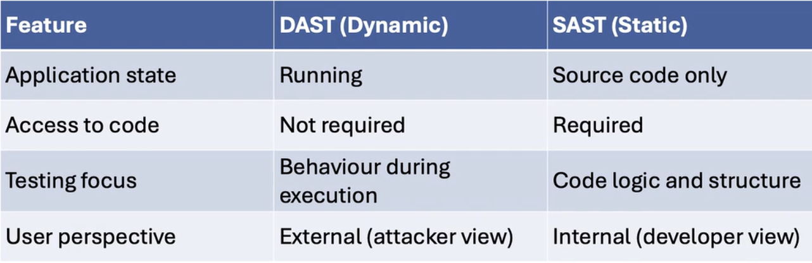

# Application security principles: Testing and debugging (part 2)
## Dynamic Application Security Testing(DAST)
- Mimics real world attacks
- Tests applications while they are running
- Focuses on runtime vulnerabilities, like:
    - Misconfiguration
    - Broke authentication 
    - Response handling errors
- Does not require access to source code

### How DAST works
- Deploy the web app in test environment 
- Run DAST tool like OWASP ZAP:
    - Interacts with login forms using automated suspicios inputs, like:
        - admin' OR '1'='1
        - ``` <script>alert('xss')</script>```
    - If application responds with unexpected behavior or error messages:
        - DAST flags possible SQLI and XSS vulnerabilities
        - You recieve report of issues it have found
        - Fix the issues from report, and run again

### SAST vs DAST
- Challenges of DAST:   
    - May miss internal or logic based bugs
    - Needs working test or staging app
    - Risk of false positives or incomplete test coverage
    - 

### Black box testing 
- Tester has no access to code or system internals
- The tester simulates an outsider with no prior knowledge
- It tests the system purely through its interfaces
- Ideal for mimicking external attacks

### Grey box testing
- Tester has partial knowledge of systemm
- They may know architecture, credentials or user roles
- Combines targeted internal understanding with external testing without the need to fully access the source code

### Popular DAST tools
- OWASP ZAP
- BURP Suite
- Acunetix
- Netsparker
- IBM AppScan
- Qualys Web Application Scanner