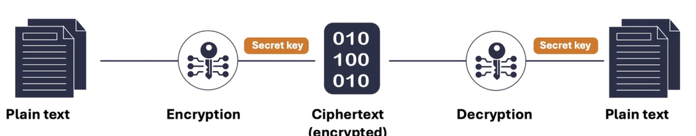
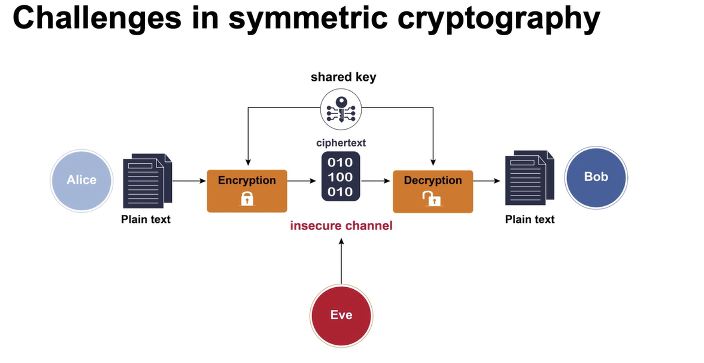
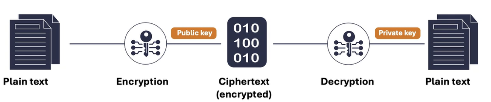
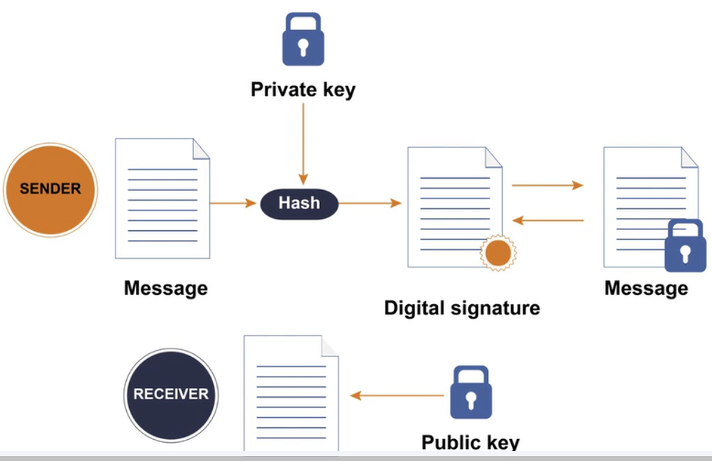
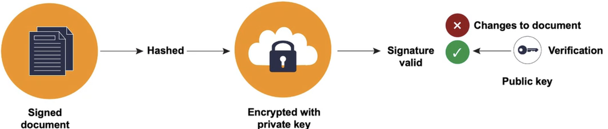
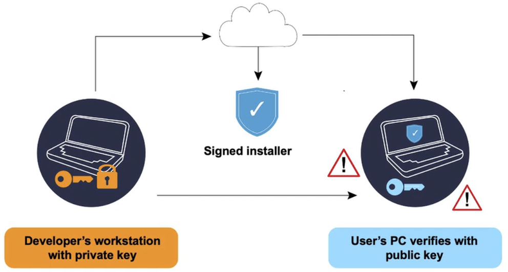

# Cryptography in practice-encryption,PKI, digital signatures, hash functions.(part1)
## Introduction to cryptography
- Cryptography is is science of securing data using cryptography
- Protection of personal messages, bank details, passwords etc.
- Prevention of tampering and unauthorised access
- Key terms:
    - Encryption:
        - Changing plaintext data into cyphertext
    - Decryption:
        - Changing cyphertext into plaintext
    - Key:
        - Secret password/number used in both encryption and decryption
    - Cipher:
        - Method/Algorithm used to encrypt and decrypt data

## Key management
- Process of handling cryptographic keys throughout their lifecycle
- Includes key:
    - Generation
    - Distribution
    - Storage 
    - Rotation
    - Deletion
    - Expiration date setting
    - Access management
- Best practices:
    - Use secure key generators
    - Store in protected vaults or hardware
    - Never embedd in source code or configuration files
    - Rotate keys regularly
    - Limit access to keys using strict controls
    - Log all key related actions for auditing and incident response

## Symmetric cryptography
- Uses single shared key for both encryption and decryption
- Same key must be shared in a safe way between parties before communication starts
- 
- 
- Used in many places due to its **speed** and **efficiency**, for example:  
    - Database records
    - Files on devices
    - Mobile app communications
    - VPN's
    - Transaction data in financial systems

### Advanced Encryption Standart(AES)
- Symmetric encryption algorithm
- Encrypts data in blocks using multiple rounds of substitution and transformation based on the keylengths
- Scrambles data using shared secret key
- Supports different key-lengths:
    - 128 bit
    - 192 bit
    - 256 bit
- Fast, secure,and resistant to many attack methods

## Asymetric cryptography
- Slower than symmetric encryption
- Uses Public key(encryption)/Private key(decryption) pair
- 

### Key terms
- Public key:
    - Ecrypt or verify
- Private key:
    - Decrypt or sign
- Key pair:
    - Two keys that work together
- Digital signatures:
    - Prove identity and message integrity using a private key

### How Asymetric encryption works
- Sender uses receivers public key to encrypt data
- Only receiver can decrypt data using his private key
- Used for privacy and secure messages
- Public key can be shared freely

### Use cases of asymetric encryption
- Secure websites and email
- Blockchain and crypto-currencies
- Software licensing
- VPN's

### Advantagees and limitations od asymetric encryption
- +Secure without shared keys
- +Supports authentication
- -Slower than symmetric methods
- -Need more processing power

### Common asymetric algorithms
- Rivest-Shamir-Adleman(RSA):
    - Widely used for encryption and signing
- Elliptic curve cryptography(ECC):
    - Secure with smaller key sizes
- Diffie Hellman:
    - Used to securely exhange keys

## Ceasar Cipher in python
- See ceasar.py
- Substitution cipher
- Each letter is shifted by a fixed number of places down the alphabet

## Cryptographic algorithms and hash functions
### Hash function
- Converts data into fixed length output
- Input and output are always the same length, regardless of the length of the input
- One way, irreversible process
- Even small change in input will create completely different output

### Key properties of hash functions
- Deterministic and fast:
    - Same input, always produces exactly the same output
- Irreversible:
    - Can't reverse engineer input from the output
- Avalanche effect:
    - Small input change causes large output change, totally different
- Collision resistant:
    - No two inputs can produce the same output

### Hash functions vs Encryption
- Hashing functions has no key and cannot be reversed
- Used for verification, not confidentiality
- Helps detect tampering and errors

### Use cases: 
- Password storage
    - Store only hashed version of passwords
    - User input is hashed and compared with stored hash
    - Prevents original passwords from being exposed
- Data integrity:
    - Hashes verify downloaded or received files
    - Mismatch indicated tampering or corruption
    - Used in software, backups and messages

### Common Hash algorithms
- MD5:
    - Fast but outdated
- SHA-1:
    - Outdated and weak
- SHA-2/SHA3:
    - Modern, trusted and in use

### **Check hashing.py file in this folder**

### Strengths and weaknesses of hash functions
- +Fast and simple
- -Weak hashes are vulnerable to attacks

## Digital signatures
- DS is a mathematical method for verifying authenticity and integrity of message or document
- Works like handwritten signature, but in digital format
- Proves origin and prevents tampering

### How DS works
1. Sender applies cryptographic hash function to original message, producing fixed size digest
2. This digest is encrypted using senders private key, creating a digital signature
3. Recipient recieves both original message and the digital signature
4. To verify the message ,recipient uses senders public key to decrypt the signature and obtain the original hash
5. They hash the received message themselves, and compare it with the decrypted hash
6. If they match, the signature is verified, and message is trusted
- **Yes, it sort of swaps private/public encryption/decryption, i looked it up, but that's how it works**
    - 
 
### DS Key concepts
- Private key:
    - Used by sender to create a signature
- Public key:
    - Used by recipient to verify signatures
- Hash function:
    - Used to summarize the content into fixed size digest
- Digital certificate:
    - Links public key to an identity (usually issued by certificate authority)

### Use cases
- Email signing:
    - Confirms the sender and also message integrity
    - Protects against spoofing and fraud
    - Used in secure and enterprise email systems
- Software signing:
    - Validates software source and integrity
    - Prevents tampered updates and malware
    - Trusted in OS and app distributions
- Legal documents:
    - Proves document authorship and time
    - Recognized under digital signature laws
    - Used in e-signatures and banking and digital contracts in procurement systems

### Main Algorithms for DS
- Rivest-Shamir-Aldeman(RSA):
    - Based on factorisation of large numbers
    - Supports signing and encryption
- Digital Signature Algorithm(DSA):
    - US government created and backed algorithm
    - Used in secure applications
- Elliptic Curve Digital Signature Algorithm(ECDSA):
    - More efficient and secure with shorter keys

### Example in python at ds.py in same folder

### Strengths and limitations
- +Strong against forgery and tampering
- -Depends on private key security and trust in certificate authorities

## Common Cryptography applications
### Secure websites(HTTPS)
- Built on Transport Layer Security(TLS)
- When visiting secure website:
    1. Website sends Digital Certificate to browser to ptove its identity
    2. Session key is negotiated
    3. All comunications is encrypted
- Relies on:
    - RSA or ECDSA for key exchange
    - Symmetric algorithm like used AES for content encryption
    - Hashing function like SHA256 for message integrity

### Encrypted messaging (Signal, WhatsApp)
- End-to-End encryption protects message content
- Not even the app provider can access the data (Really tho?)
- For example, Signal relies on:
    - X3DH for key agreement
    - Double Ratchet for session updates
    - AES and HMAC for secure verified messaging

### Digital signature on documents
- 

### Code signing
- 